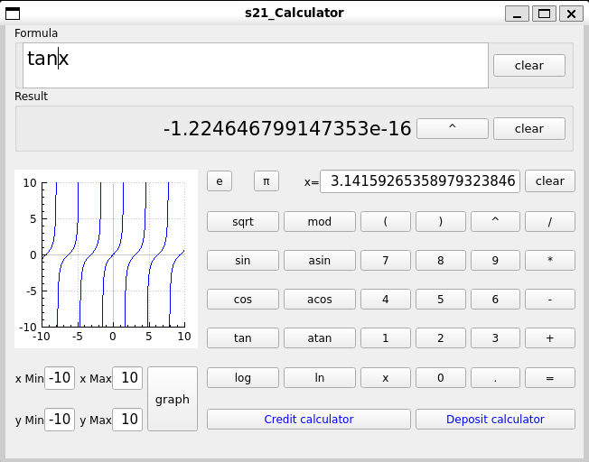
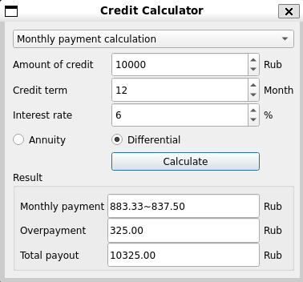
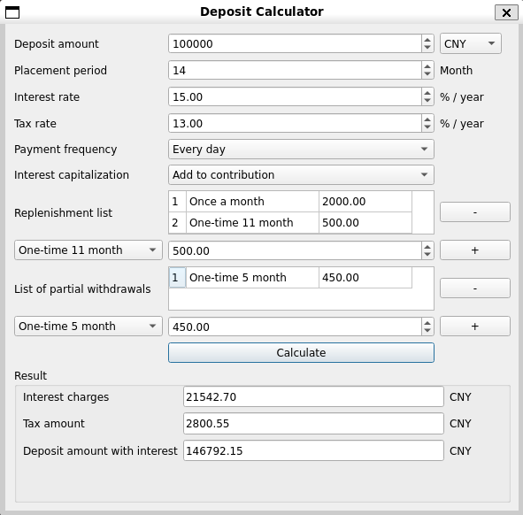

# SmartCalc_2
Smart Сalculator with extended functionality: plotting functions, loan and deposit calculator.

Qt Framework

Program language C++17

Used MCV pattern

## Overview

The calculator is a complete solution capable of calculating both basic arithmetic operations and trigonometric functions. In addition, it is possible to plot a function graph, and two additional financial calculators separately. The loan calculator is used to calculate the monthly payment, the loan term and the maximum loan amount. The deposit calculator is used to calculate the income from investments.

## Installation

    make install

Default installation folder - `Desktop`

## Usage
To start using the calculator, launch it. At the top of the calculator there is a function input field for calculation, input can be done manually using the keyboard or by pressing the corresponding keys on the calculator itself. After finishing the input, to get the result, you need to press the "Enter" button on the keyboard or the "=" button on the calculator. The input field allows entering numbers in exponential form using "." or "," to separate the fractional part. Functions can be entered in both uppercase and lowercase letters. The input of the function allows the omission of parentheses and multiplication signs, but the operator needs to follow the logic of such omissions, otherwise you can get an incorrect result. You can use the variable "X" in the function if its value is defined in the corresponding field, or if the function is used to plot a graph. The "Clear" keys on the calculator clear the corresponding fields. The "^" key next to the "Result" field copies the contents of the result into the "Function" field. The "Pi" key inserts the value of pi into the "X" value field.

### Graphic

To build a function, you need to enter the function in the Function box using the description guide above and click the Graph button. In the lower left corner there are fields for controlling the chart scale. Limit values are from -1,000,000 to +1,000,000. If one of the "X" coordinates is entered incorrectly, the calculator will automatically correct it. If both values are not correct, the plot will not be plotted in the default coordinates -10 to +10. Incorrect entry of the "y" coordinates will automatically determine the "y" axis where the function exists based on the limit values.

### Credit calculator

The credit calculator opens after clicking the "Credit Calculator" button at the bottom of the calculator. It is proposed to figure out the work of this calculator on your own.

### Debit calculator

The debit calculator opens after clicking the "Debit Calculator" button at the bottom of the calculator. It is proposed to figure out the work of this calculator on your own.

## Remove

    make uninstall
